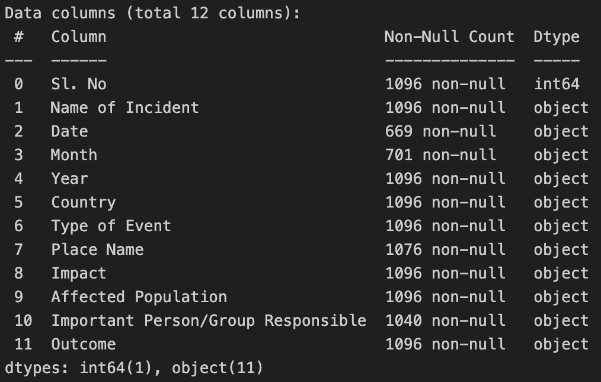
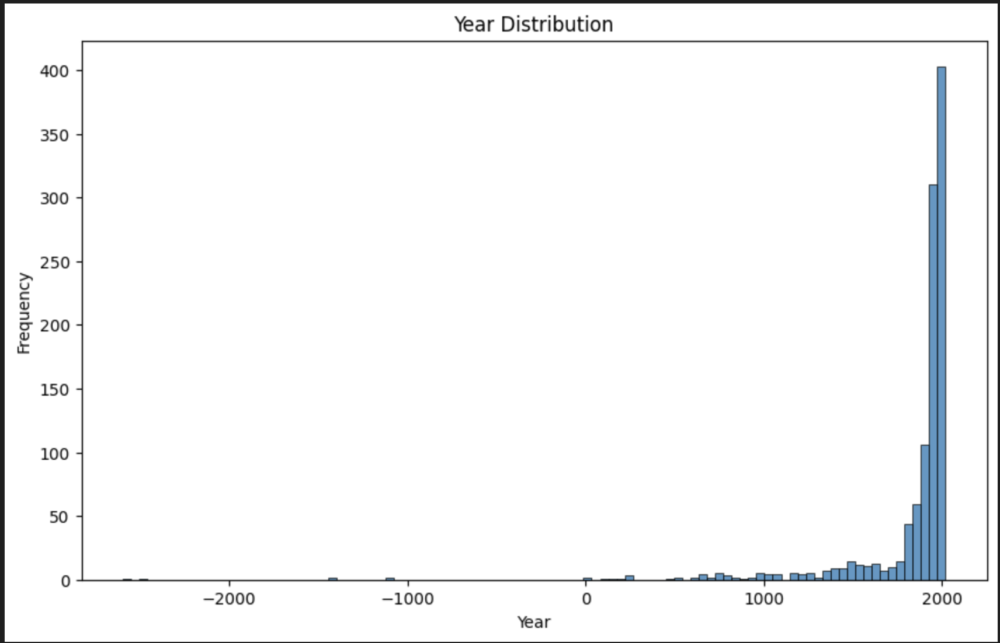
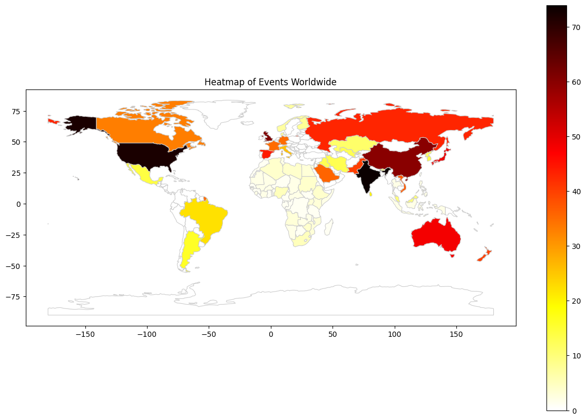
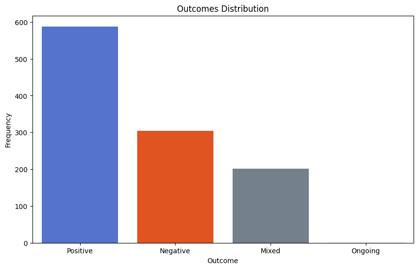

### COM-480 Data Visualization - Milestone 1
#### Dataset
For the course project, we have chosen the dataset "World Important Events - Ancient to Modern" from Kaggle. This dataset provides a comprehensive catalog of significant historical events, tracing the arc of human history from the dawns of civilization to the complexities of the modern age. Each event within the dataset is systematically documented with key details including serial number, event name, date, country, event type, specific location, the event's impact, affected populations, key individuals or groups involved, and the outcome of the event.
Upon initial review, the dataset appears comprehensive and structured, making it a promising foundation for in-depth analysis and visualization. However, to harness its full potential and ensure the creation of accurate and effective historical visualizations, we must first address several crucial aspects of data quality and integrity:
* Consistency: We will ll verify the consistency of event categorizations and terminologies across different historical periods to maintain a coherent analysis framework. 
* Completeness: Identifying missing data, especially in fields critical for analysis like dates, places, or impacts, will be essential. Incomplete records may require imputation or exclusion based on their significance.

#### Problematic: Visualization of History's Pivotal Moments
##### Main idea:
Our project aims to create a dynamic and interactive visualization that narrates the story of human history through its most defining events. We aspire to:
* Showcase the Global network of Historical Events: Highlight how events in different regions and times interconnect, reflecting the global nature of human history.
* Temporal and Spatial Journey: Enable users to travel through time and space, exploring events across various eras and locations, understanding the context and impact of each pivotal moment.

##### Overview and Motivation:
Our motivation stems from the desire to make history accessible, engaging, and insightful for a wide audience. By leveraging this dataset, we aim to:
* Educate and Engage: Serve as an educational tool for children, students, history enthusiasts, and the general public, fostering a deeper understanding of historical events and their impacts.
* Provide Insights: Offer insights into patterns, trends, and the interconnectedness of events, contributing to a richer comprehension of global history.

##### Target audience:
Our primary audience includes educational institutions, history enthusiasts, and the general public with an interest in understanding the course of human events in an interactive and engaging manner. We envision our project as a bridge connecting past events with present interests, inviting users to explore history from ancient times to the modern era.

##### Here's a deeper dive into some concrete visualization ideas we aim to explore and potentially propose:
**1. Interactive Timeline with Filterable Categories**
Imagine a dynamic, scrollable timeline that spans from ancient civilizations to contemporary events. Users can filter this timeline by event type (e.g., wars, revolutions, technological advancements), geographic region, or even specific outcomes (positive, negative, mixed). This allows for a customized exploration of history, tailored to the user's specific interests or research needs.

**2. Geographic Heatmaps and Event Density Maps**
Beyond a simple map, we'll implement geographic heatmaps to illustrate the concentration of various types of events across different regions and epochs. For instance, a heatmap could highlight areas of intense conflict, revolutionary activities, or regions with significant technological innovations. Event density maps can show how certain areas of the world have been hotspots for historical activity over certain periods.

**3. Comparative Graphs and Tables**
To delve deeper into the data, we plan to include comparative graphs and tables that allow users to examine trends over time, such as the frequency of different event types, the impact on affected populations, or the involvement of key figures and groups. These visualizations can offer insights into how certain events have shaped societal, cultural, or technological developments.

**4. Symbolic Representation of Events**
To enhance the visual appeal and immediate understanding of the dataset, we will use distinctive logos and symbols to represent different types of events. For example, a crossed sword icon could denote wars, a lightbulb for technological advancements, and a quill for significant cultural or political documents. These symbols can help users quickly identify the nature of events as they explore the visualization.

**5. Interactive Global Pathways**
Beyond static maps, we envision creating interactive pathways that trace the influence of certain events or figures across different regions and times. For example, users could follow the spread of innovations from the Industrial Revolution or the migration patterns resulting from significant conflicts. This feature would allow users to visually track how events in one area can influence distant regions over time.

### Exploratory Data Analysis

Through this part of the project, we aim to:

* Conduct a comprehensive data cleaning process to ensure the dataset's integrity and consistency.
* Extract key insights from the data to guide our visualization design and narrative.

(All the code for this part can be found in the `preprocessing.ipynb` notebook.)

#### Basic Statistics and Insights:

The dataset we're using countains 12 columns and 1096 rows. the columns are as follows:

1. `SI. No`: A unique identifier for each event.
2. `Name of Incident`: The name or title of the event.
3. `Date`: The day when the event occurred.
4. `Month`: The month when the event occurred.
5. `Year`: The year when the event occurred.
6. `Country`: The country where the event occurred.
7. `Type of Event`: The category or type of event (e.g., war, revolution, natural disaster).
8. `Place Name`: The specific place or region where the event occurred.
9. `Impact`: The impact or consequences of the event.
10. `Affected Population`: The population or groups affected by the event.
11. `Important Person/Group`: The key individuals or groups involved in the event.
12. `Outcome`: The outcome or result of the event (positive, negative, mixed or ongoing).

#### Data Cleaning:

The first step in our exploratory data analysis will involve cleaning the dataset to ensure its quality and consistency. 

One of the primary challenge in working with historical data is the potential missing information. Depending on the work we want to conduct on those data this can be a major issue. In the case of our dataset, we don't have a lot of missing value as we can see below:

And they are mostly in the `Month` and date column which is not a big issue as we can still work with the `Year` column. However we have in the year columns some values that we can't work with such as `BC`. To solve this issue we decided to convert those values to negative year in order to not lose the information but to still have consistent data.

Another issue is that we need to have a standardized country name in order to be able to work with the data. We have some country names that are not standardized such as `USA` and `United States`. As for this milestone we wanted to see a repartition of event on a world map we choose to use the geopandas library, and thus we manually replace the country names that does not had a match in the geopandas library.

#### Insights:

After cleaning the data, we performed some basic exploratory data analysis to gain insights into the historical events dataset. Here are some key findings:

**Date Distribution** : We first had a look to the distribution of the events over the years. As you can see on the image below, The dataset contains event since 2600 BC to our times but the big majority of the events are from the 20th century. This is an expected result are we have more data from recent years than from ancient times.

**Country Distribution** : We also had a look to the distribution of the events over the countries. As you can see on the image below, the dataset contains events from all around the world. However, some countries have more events than others. In particular we have a lot of historical events in the United States, India, United Kingdom and China. This is also an expected result as those countries have a long history and have been involved in a lot of historical events with the major part of it beeing well documented because relativly recent.

**Outcome Distribution** : Finally we had a look to the distribution of the events over the outcomes. As you can see on the image below, the dataset contains events with different outcomes. The majority of the events have a positive outcome which is quite surprising as we would have expected to have more negative outcomes, maybe because those are more documented and remebered. This is an interesting result that we will have to investigate further.

### Related Work 

We found a lot of visualisations of specific events, especially specific battles. But we did not find a lot of visualisations of global events across space and time.

The visualisations that we found to be the closest to what we want to acheive were documentary videos, mainly found on youtube. These videos display important events on a map and across time. We will use them as a source of inspiration but we aim to create visualisations that are more advanced and interactive. 

Our approach is original because we want to create a global visualisation of events across mankind, differentiating ourselves from usual historical visualisations that are more specific.
Our visualisation will enable our target audience to get a global, interactive and general view of events across Human history.